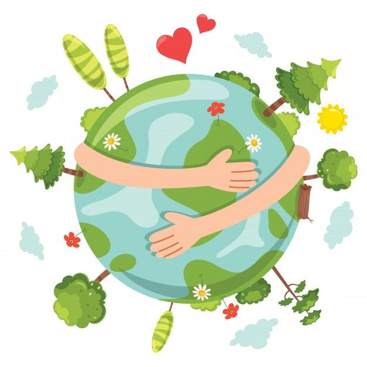

# 👋 Hi, I'm Maryam Refaa Skaik
**Backend Developer | Automation & AI Enthusiast | Computer Science Graduate**

---

## 🌱 About Me
I am a **fresh Computer Science graduate** passionate about building robust backend systems using **Laravel** and **Node.js**.  
I enjoy **automation, API development**, and solving real-world problems with scalable solutions.  

**Currently learning:** Advanced Event Loop Optimization in Node.js & Modern Automation Workflows  

---

## 🛠️ Skills

### 💻 Languages & Frameworks

### 🛠️ Tools & Platforms

### 🌐 Others
REST APIs | Event Loop Optimization | Web Automation | JWT Authentication | MVC Architecture

---

## 📂 Featured Projects

### 🔹 Gaza Madad Flow 🌍
  

A **Laravel-based web automation system** for humanitarian aid registration in Gaza.  

**Impact:**  
- Automates multi-platform aid submission  
- Reduces manual work by **80%**  
- Works under unstable internet conditions  

**Tech Stack:** Laravel, PostgreSQL, n8n, Google Sheets, Render, TailwindCSS  

**Links:**  
[🎥 Demo Video](https://drive.google.com/) | [📁 Repository](https://github.com/Maryam-Skaik/GazaMadadFLow)

---

### 🔹 Volunteer Coordination Web App
  

**Laravel + React web app** to manage volunteers, tasks, and work locations.  

**Features:**  
- Admin authentication & CRUD operations  
- Assign volunteers to tasks & locations  
- Frontend with React, Vite, TailwindCSS, CoreUI  

**Tech Stack:** Laravel, MySQL, React, TailwindCSS, CoreUI  

[📁 Repository](https://github.com/Maryam-Skaik/volunteer-coordination-system)

---

### 🔹 Alternative Medicine API
  

**Node.js RESTful API** for managing drugs, pharmacies, and alternative medicines.  

**Features:**  
- JWT authentication for admin  
- CRUD endpoints for drugs & pharmacies  
- Maps alternative medicines for unavailable drugs  
- MongoDB integration with validation  

**Tech Stack:** Node.js, Express.js, MongoDB, JWT, dotenv, bcryptjs  

[📁 Repository](https://github.com/Maryam-Skaik/alternative-medicine-api)

---

## 📈 GitHub Stats

---

## 📫 Connect with Me
  

